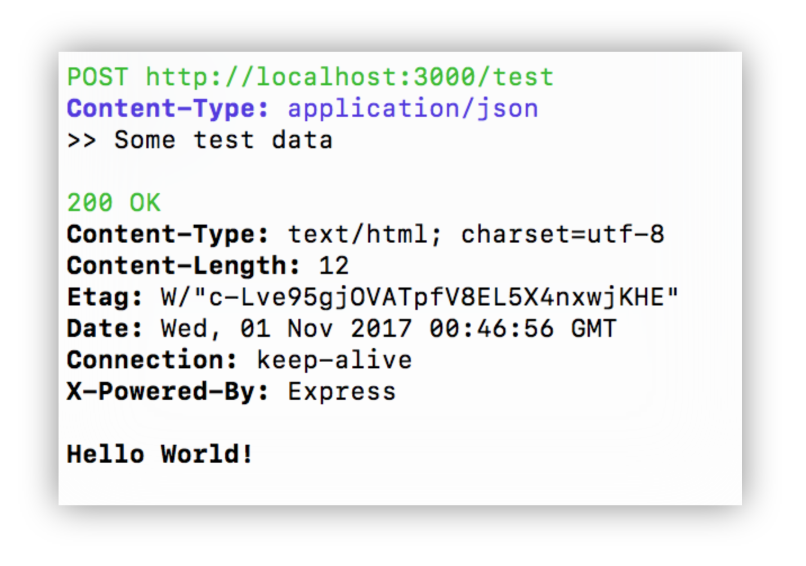

# go-http-cli
[](https://travis-ci.org/visola/go-http-cli) [](https://goreportcard.com/report/github.com/visola/go-http-cli)

An HTTP client inspired by `curl` and `httpie` made in Go.

## Profiles

**IMPORTANT! Please don't store your passwords on plain text files! Use this only for local/development environments.**

`go-http-cli` can use profile files, which are just configuration files in a special location.
The location by default points to `${user.home}/go-http-cli` but it can be configured through the
environment variable `GO_HTTP_PROFILES`.

To activate a profile just add `+profileName` as part of your arguments. In this case, it would look for a `${user.home}/go-http-cli/profileName.{yml|yaml}` file. It will fail if it can't find it.

An example would be to setup a yaml file like the following:

```yaml
baseURL:
  https://family-menu.herokuapp.com/api/v1
headers:
  Content-type:
    - application/json
  Authorization:
    - Bearer ${your-token-here}
variables:
  companyId: 123456
```

And then you can just call the api like the following:

```bash
$ go-http-cli +family '${companyId}/people'

GET https://family-menu.herokuapp.com/api/v1/123456/people
Content-Type: application/json
Authorization: Bearer your-token-here
```

The path can be a relative path or an absolute path. The algorithm is very simple, it just concatenates
`baseURL` with `URL` making sure only one `/` will exist between the two. It will also use the variables
set in the configuration file to replace the ones in the URL.

## Examples

Example command pointing to a test server:

```bash
go-http-cli \
  -H Content-Type=application/json \
  -X POST \
  -d "Some test data" \
  http://localhost:3000/test
```

Output:


